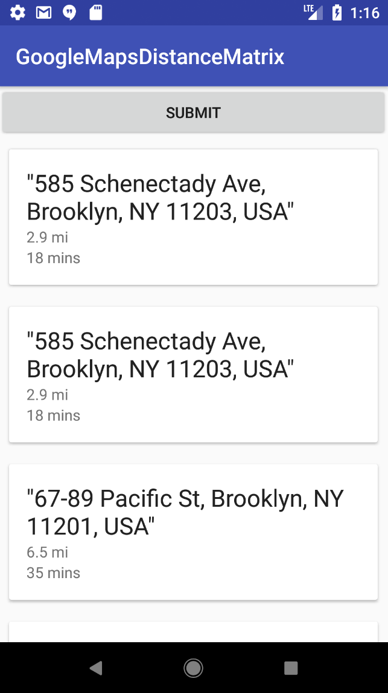

# Android-GoogleMapsAPI

<h3>Description</h3>

Using GoogleMaps API: Distance Matrix, Distance, Duration from Origin to Multiple Destinations are calculated.

<h3>Implementation</h3>

Multiple Locations distance/duration requests can be asked at one time to Google Maps. In this example, 14 destinations are asked to Google Maps.
Distance Matrix is part of Google Maps API which outputs distance and duration from origin to destination. Data request is made through HttpURLConnection: "GET."
JSON object is analyzed with Gson. RecyclerView displays destinations vertically. OnClickEvent displays Map.

